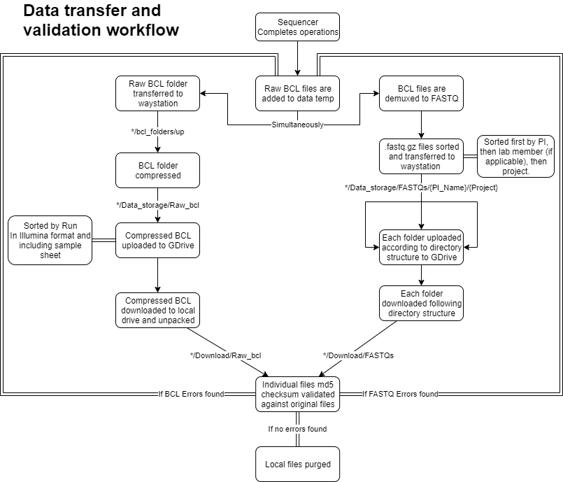

# google_drive_manager
General scripts used to manage raw data storage on google drive. 

## Setup
To run this, you will need to first set your google drive to be api accessible and then create your key file ('client_secret.json') through your account. I have included a wrapper script that pulls this all together into a functional unit. Run the setup.py script to create the directory structure as I have done. 
*The wrapper compresses the BCL folders to tar.gz for upload. GDrive appears to have issues with raw BCL files*

From there, set your path accordingly in the script as needed. You also will need to replace the PARENT_FOLDER parameter with the appropriate google drive folder ID. I have a temporary one in there as a place holder for now. 

### Wrapper workflow


### To upload:
```python
import bcl_upload
bcl_upload.uploader(['/path/to/uploadfolder/'])
```
### To download:
```python
import bcl_downloader
bcl_downloader.downloader([['GDrive_foldername','/path/to/downloadfolder/']])
```
